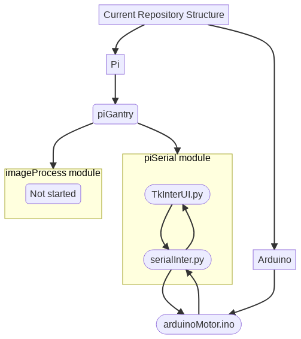

# GantryBot


#### Description
Gantry Bot is a dual axis, dual servomotor driven machine automating data collection w/ MuMos. It uses an arduino for servomotor locomotion and a Pi for higher level tasks and camera control / image processing.

See [changelog](CHANGELOG.md) for more info
##### *Currently requires an instance of Arduino IDE*

## Prerequisites

#### Python 3.x

#### Arduino 1.5.6 or compatible

Refer to [**ARDUINO(1) Manual Page**](https://github.com/arduino/Arduino/blob/master/build/shared/manpage.adoc)

#### Arduino IDE 1.8.13 or compatible
* [Arduino IDE downloads **All**](https://www.arduino.cc/en/software)
* [Arduino IDE guide **Linux**](https://www.arduino.cc/en/guide/linux)


## Installation

``` bash
#Clone the repo w/ 
$ git clone https://github.com/CandidDisk/GantryBot.git GantryBot
#Install required python libraries w/
$ pip install -r requirements.txt

#To be updated once installation is standardized
```

* also stick to mixed case for now plz

## Project Overview


